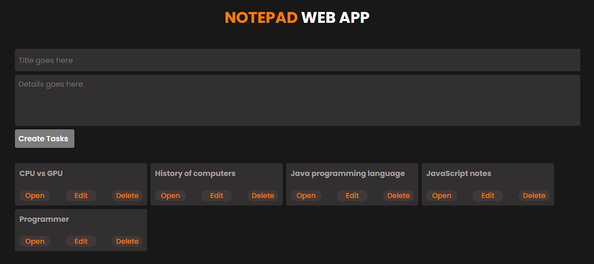

# Notepad Web App
## 🚀 Overview
A simple Notepad Web Application built with Node.js and Express.js that allows users to create, edit, and delete notes efficiently. The Notepad Web App is designed to be lightweight, user-friendly, and efficient for managing notes. It provides a simple and easy interface to create and organize notes.

 

## 🚀 Screenshots

 

## 🚀 Features
- <b>Create, Edit, and Delete Notes –</b> Users can add new notes, edit existing ones, and delete notes through the frontend interface.
- <b>File-Based Storage (No Database Required) –</b> Every note is saved as an individual file in the backend using Node.js' fs module.
- <b>Automatic File Deletion –</b> When a note is deleted from the frontend, the corresponding file is also removed from the backend storage.
- <b>Dynamic Rendering with EJS –</b> The frontend dynamically updates using EJS, providing a seamless user experience.
- <b>Built with Node.js fs Module –</b> The entire note-saving mechanism is handled using the fs (File System) module in Node.js, eliminating the need for a database.

 

## 🚀 Tech Stack
- <b>Frontend:</b> EJS & CSS
- <b>Backend:</b> Node.js & Express.js

 

## 🚀 Deployment
The app is deployed on <b>Vercel</b> and can be accessed via:
 
https://webapp-notepad.vercel.app/

 

## 🚀 Contact
- Email: ibadhussain2212@gmail.com
- LinkedIn: www.linkedin.com/in/ibadhussain